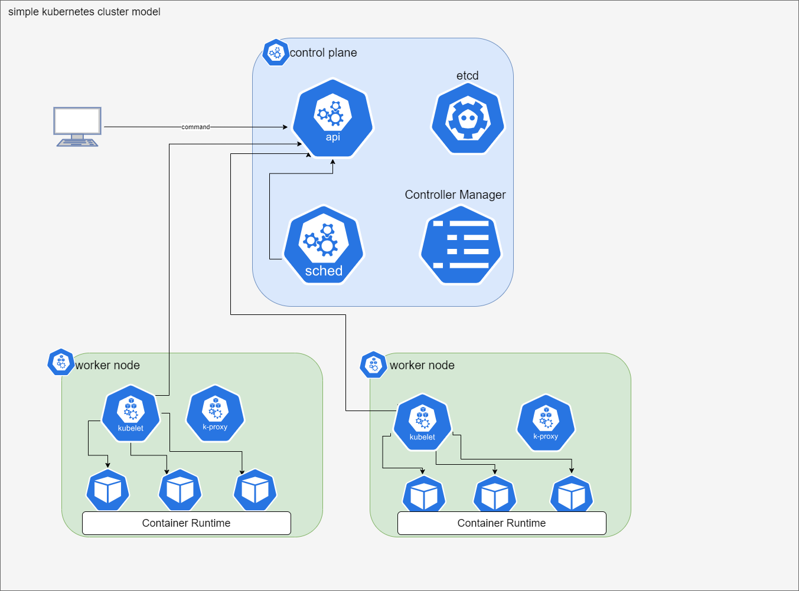
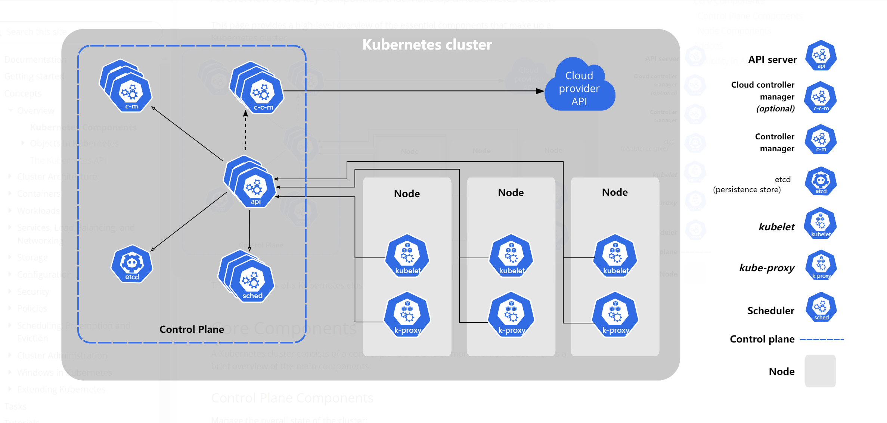

#                                          kubernetes 学习笔记

## 1.overview

Kubernetes is a portable, extensible, open source platform for managing containerized workloads and services, that facilitates both declarative configuration and automation. It has a large, rapidly growing ecosystem. Kubernetes services, support, and tools are widely available.

### 1.2.Kubernetes provides 

- **Service discovery and load balancing** Kubernetes can expose a container using the DNS name or using their own IP address. If traffic to a container is high, Kubernetes is able to load balance and distribute the network traffic so that the deployment is stable.
- **Storage orchestration** Kubernetes allows you to automatically mount a storage system of your choice, such as local storages, public cloud providers, and more.
- **Automated rollouts and rollbacks** You can describe the desired state for your deployed containers using Kubernetes, and it can change the actual state to the desired state at a controlled rate. For example, you can automate Kubernetes to create new containers for your deployment, remove existing containers and adopt all their resources to the new container.
- **Automatic bin packing** You provide Kubernetes with a cluster of nodes that it can use to run containerized tasks. You tell Kubernetes how much CPU and memory (RAM) each container needs. Kubernetes can fit containers onto your nodes to make the best use of your resources.
- **Self-healing** Kubernetes restarts containers that fail, replaces containers, kills containers that don't respond to your user-defined health check, and doesn't advertise them to clients until they are ready to serve.
- **Secret and configuration management** Kubernetes lets you store and manage sensitive information, such as passwords, OAuth tokens, and SSH keys. You can deploy and update secrets and application configuration without rebuilding your container images, and without exposing secrets in your stack configuration.
- **Batch execution** In addition to services, Kubernetes can manage your batch and CI workloads, replacing containers that fail, if desired.
- **Horizontal scaling** Scale your application up and down with a simple command, with a UI, or automatically based on CPU usage.
- **IPv4/IPv6 dual-stack** Allocation of IPv4 and IPv6 addresses to Pods and Services
- **Designed for extensibility** Add features to your Kubernetes cluster without changing upstream source code.

### 1.3.Core Components





#### 1.3.1.Control Plane Components

- **APIServer**:  The core component server that exposes the Kubernetes HTTP API
- **etcd**:  Consistent and highly-available key value store for all API server data
- **Scheduler**:  Looks for Pods not yet bound to a node, and assigns each Pod to a suitable node.
- **Controller-Manager**: Runs *controllers* to implement Kubernetes API behavior.
- **Cloud-Controller-Manager**: Integrates with underlying cloud provider(s)

#### 1.3.2.Node Components

- **kubelet**: Ensures that Pods are running, including their containers.
- **kube-proxy (optional)**: Maintains network rules on nodes to implement *Services*.
- **Container runtime**

#### 1.3.3 Addons(插件)

Addons extend the functionality of Kubernetes. A few important examples include:

- **DNS**： For cluster-wide DNS resolution
- **Web UI(Dashboard)**：For cluster management via a web interface
- **Container Resource Monitoring**： For collecting and storing container metrics
- **Cluster-level Logging**：For saving container logs to a central log store

### 1.4.Objects In Kubernetes

#### 1.4.1.definition

*Kubernetes objects* are persistent entities in the Kubernetes system. Kubernetes uses these entities to represent the state of your cluster. Specifically, they can describe:

- What containerized applications are running (and on which nodes)
- The resources available to those applications
- The policies around how those applications behave, such as restart policies, upgrades, and fault-tolerance

#### 1.4.2.Objects 使用yaml来定义

`application/deployment.yaml`  

- **spec**: desired state
- **status**: *current state* of the object,The Kubernetes *control plane* continually and actively manages every object's actual state to match the desired state you supplied.

```yaml
apiVersion: apps/v1
kind: Deployment
metadata:
  name: nginx-deployment
spec:
  selector:
    matchLabels:
      app: nginx
  replicas: 2 # tells deployment to run 2 pods matching the template
  template:
    metadata:
      labels:
        app: nginx
    spec:
      containers:
      - name: nginx
        image: nginx:1.14.2
        ports:
        - containerPort: 80
```

#### 1.4.3.yaml组成部分

- **apiVersion**：指定对象所属的 API 版本（如 `v1`, `apps/v1`）。
- **kind**：指定对象的类型（如 Pod, Service, Deployment）。
- **metadata**：包含对象的元信息（如名称、命名空间、标签、注解）。
- **spec**：定义对象的目标状态。
- **status**：描述对象的当前状态（由 Kubernetes 自动填充，通常不在创建时指定）。

#### 1.4.4.Object类型

##### 1. 核心资源（Core Resources）

- **Pod**：最小的计算单元，包含一个或多个容器。
- **Service**：定义网络服务以暴露应用（如 ClusterIP, NodePort, LoadBalancer）。
- **Volume**：存储资源，支持容器之间共享数据或持久化。
- **Namespace**：逻辑分区，用于隔离和管理资源。

##### 2. 控制器对象

- **ReplicaSet**：确保指定数量的 Pod 副本运行。
- **Deployment**：管理无状态应用的升级和扩展（基于 ReplicaSet）。
- **StatefulSet**：管理有状态应用（如数据库）的部署和扩展。
- **DaemonSet**：在每个节点上运行一个 Pod 副本（如日志收集器）。
- **Job** / **CronJob**：运行一次性任务或定时任务。

##### 3. 配置管理对象

- **ConfigMap**：存储非敏感的配置数据（如环境变量或配置文件）。
- **Secret**：存储敏感数据（如密码、密钥、证书）。

##### 4. 存储对象

- **PersistentVolume (PV)**：集群内提供存储资源。
- **PersistentVolumeClaim (PVC)**：用户请求存储资源的声明。
- **StorageClass**：定义动态存储的配置。

##### 5. 网络对象

- **Ingress**：HTTP/HTTPS 路由规则，用于暴露服务。
- **NetworkPolicy**：控制 Pod 之间或 Pod 与外部的网络通信。

##### 6.声明式管理 命令

```bash
$ kubectl apply -f my-object.yaml
```


### 1.Pod


资源类别

 名称空间级别

​    工作负载型资源 ：Pod   ReplicaSet  Deployment

​    服务发现及负载均衡型资源：Service  Ingress

​    配置与存储型资源：Volume CSI

​    特殊类型的存储卷：ConfigMap  Secret


集群级资源

​    Namespacen   Node   ClusterRole     ClusterRoleBing

元数据型资源

HPA    PodTemplate         LimitRange


